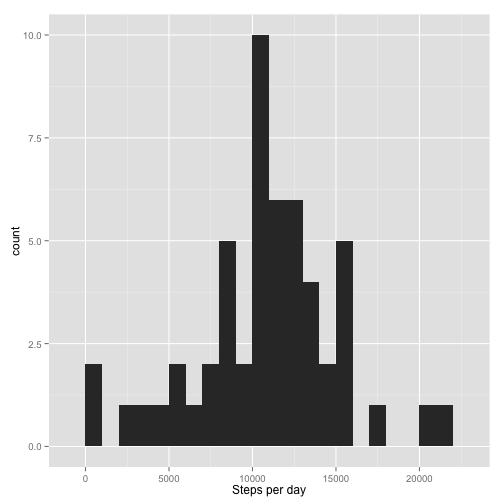

# Reproducible Research: Peer Assessment 1

## Loading and preprocessing the data

```r
unzip('/Users/andrewwahl/Desktop/Coursera/ReproducibleResearch/RepData_PeerAssessment1/activity.zip')
rr_1_data <- read.csv('/Users/andrewwahl/Desktop/Coursera/ReproducibleResearch/activity.csv', header = TRUE)
```

I'll also convert the date factors to dates.

```r
rr_1_data$date <- as.Date(rr_1_data$date, "%Y-%m-%d")
```
## What is mean total number of steps taken per day?

I plotted the histogram and also returned the mean and median.

```r
library(ggplot2)
steps_per_day.df <- aggregate(steps ~ date,data=rr_1_data, sum,na.rm=TRUE)
qplot(steps_per_day.df$steps, geom = "histogram", xlab = "Steps per day", binwidth=1000)
```

 

```r
mean(steps_per_day.df$steps, na.rm=TRUE)
```

```
## [1] 10766.19
```

```r
median(steps_per_day.df$steps, na.rm=TRUE)
```

```
## [1] 10765
```

## What is the average daily activity pattern?

I made a time series plot of the 5-minute intervals averaged across all of the days.
The averages are calculated by aggregating the intervals across all of the days


```r
averages <- aggregate(x=list(steps=rr_1_data$steps), by=list(interval=rr_1_data$interval),
                      FUN=mean, na.rm=TRUE)
ggplot(data=averages, aes(x=interval, y=steps)) +
  geom_line() +
  xlab("5-minute interval") +
  ylab("average number of steps taken")
```

 

Which 5-minute interval, on average across all the days in the dataset, contains the maximum number of steps?

```r
averages[which.max(averages$steps),]
```

```
##     interval    steps
## 104      835 206.1698
```

## Imputing missing values

The presence of missing days may introduce bias into some calculations or summaries of the data, 
so let's take a look at how we can adjust for this.

First I took a look at how many missing values there are

```r
missing_values <- is.na(rr_1_data$steps)
table(missing_values)
```

```
## missing_values
## FALSE  TRUE 
## 15264  2304
```

Missing values are replaced with the mean value of their 5-minute interval across all dates

Here's a function for filling in averages

```r
# Replace each missing value with the mean value of its 5-minute interval
fillNA <- numeric()
for (i in 1:nrow(rr_1_data)) {
  obs <- rr_1_data[i, ]
  if (is.na(obs$steps)) {
    steps <- subset(averages, interval == obs$interval)$steps
  } else {
    steps <- obs$steps
  }
  fillNA <- c(fillNA, steps)
}
```

And now the original data set is filled in.

```r
filled_data <- rr_1_data
filled_data$steps <- fillNA
```

And here's a histogram of the total number of steps taken each day.  Again the mean and median total number of steps are calculated as well.


```r
total.steps <- tapply(filled_data$steps, filled_data$date, FUN=sum)
qplot(total.steps, xlab="total number of steps taken each day", binwidth = 1000)
```

 

```r
mean(total.steps)
```

```
## [1] 10766.19
```

```r
median(total.steps)
```

```
## [1] 10766.19
```

## Are there differences in activity patterns between weekdays and weekends?

Here is a function to calculate the day of the week using the weekdays() function.


```r
week_flag <- function(date) {
  day <- weekdays(date)
  if (day %in% c("Saturday", "Sunday"))
    return("weekend")
  else if (day %in% c("Monday", "Tuesday", "Wednesday", "Thursday", "Friday"))
    return("weekday")
  else
    stop("invalid date")
}
filled_data$date <- as.Date(filled_data$date)
filled_data$day <- factor(sapply(filled_data$date, FUN=week_flag))
```

Lastly here's a panel plot containing plots of average number of steps taken
split by weekdays and weekends.

```r
averages <- aggregate(steps ~ interval + day, data=filled_data, mean)
ggplot(averages, aes(interval, steps)) + geom_line() + facet_grid(day ~ .) +
  xlab("5-minute interval") + ylab("Number of steps")
```

 
